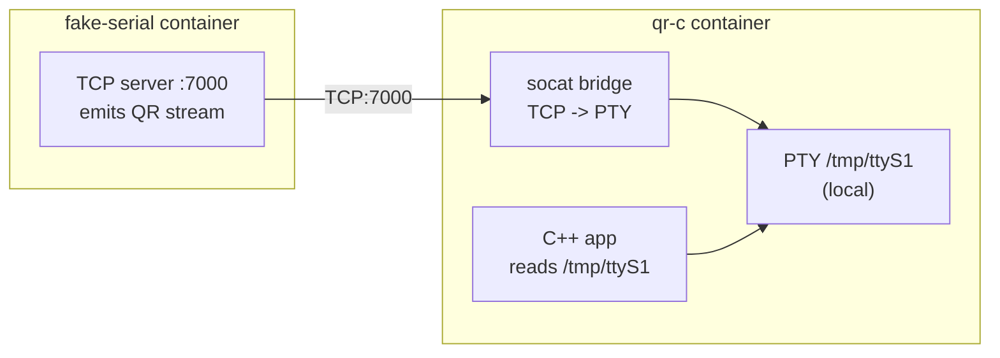
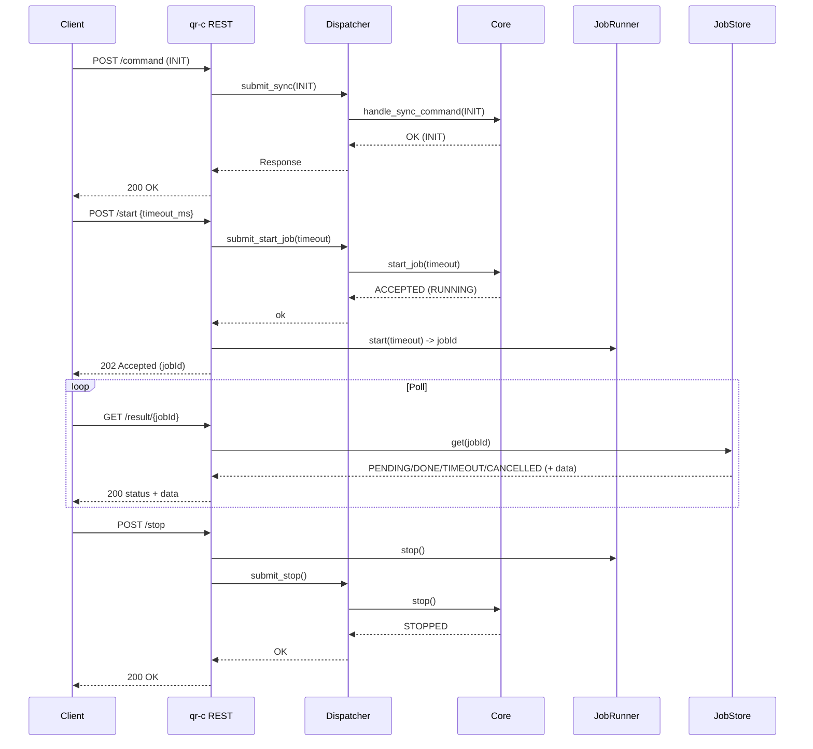

# qr-edge-gateway — Fake QR Reader (Serial Emulation + REST API)

This repository provides a **containerized fake QR reader** used to validate end-to-end flows where a device reads QR codes from a serial-like interface and exposes results via a REST API.

It includes:

- **fake-serial**: a TCP-based serial simulator that emits QR payload frames.
- **qr-c**: a C++ service that bridges TCP → local PTY and exposes a REST API.
- **api-test**: pytest-based black-box tests.
- **contract-test**: Schemathesis-based OpenAPI contract testing.

---

## Table of Contents

- [Quick Start](#quick-start)
- [Architecture](#architecture)
- [API](#api)
- [Configuration](#configuration)
- [Testing](#testing)
- [Troubleshooting](#troubleshooting)
- [Repository Layout](#repository-layout)
- [Notes & Limitations](#notes--limitations)

---

## Quick Start

### 1) Build and run the core services

```bash
docker compose up -d --build fake-serial qr-c
```

Verify readiness:

```bash
curl -s http://127.0.0.1:8080/health
curl -s http://127.0.0.1:8080/status
```

Expected:

- `/health` → `{"ok":true,"message":"UP"}`
- `/status` → `{"ok":true,"state":"NOT_INIT"}` (initially)

### 2) Initialize (INIT) and run a job

INIT (Option B: baudrate via params):

```bash
curl -s -X POST http://127.0.0.1:8080/command   -H 'Content-Type: application/json'   -d '{"command":"INIT","params":{"baudrate":115200}}'
```

Start a job:

```bash
curl -s -X POST http://127.0.0.1:8080/start   -H 'Content-Type: application/json'   -d '{"timeout_ms":3000}'
```

Poll the result (replace `<jobId>`):

```bash
curl -s http://127.0.0.1:8080/result/<jobId>
```

Stop (cancels an active wait and stops the core):

```bash
curl -s -X POST http://127.0.0.1:8080/stop
```

---

## Architecture

### Why PTY sharing across containers fails

A common mistake is to create a PTY in one container and share the `/tmp/ttyS1` link via a volume.

This fails because:

- PTYs live under `/dev/pts/N` in `devpts`.
- Each container has its own `devpts` namespace.
- `link=/tmp/ttyS1` is only a symlink to a PTY that exists *inside the container that created it*.
- Sharing `/tmp` shares the symlink text, not the PTY node.

**Conclusion:** the PTY must be created in the same container where the application opens it.

### Selected design

- Transport between containers: **TCP**
- Local serial endpoint for the app: **PTY inside `qr-c`**
- Bridge: **socat** inside `qr-c`



### Domain execution model

- REST requests (Crow) submit work to a **single-threaded Dispatcher**
- Dispatcher serializes all calls into the Core (state machine)
- `/start` triggers a job; the JobRunner reads serial data and writes results to JobStore
- `/result/{id}` polls JobStore

```mermaid
flowchart TB
  subgraph Adapters["Adapters"]
    R[REST Adapter\n(Crow)]
  end

  D[Dispatcher\n(single worker thread)]
  C[Core\nState machine]
  JR[JobRunner\nserial read + timeout + reconnect]
  JS[JobStore\nin-memory results]

  R --> D
  D --> C
  JR --> JS
  R --> JS
```

---

## API

The OpenAPI specification lives under:

- `docs/openapi.yaml`

### Endpoints

- `GET /health`  
  Returns liveness: `{ ok, message }`

- `GET /status`  
  Returns Core state: `{ ok, state }`  
  States: `NOT_INIT | INIT | RUNNING | STOPPED`

- `POST /command`  
  Executes synchronous commands (`PING`, `INIT`, `STOP`).  
  Body:
  ```json
  {"command":"PING","params":{}}
  ```
  Notes:
  - `params` must be an object if present (never `null`).
  - `INIT` supports Option B: `params.baudrate` or top-level `baudrate`.

- `POST /start`  
  Starts an async QR read job. **JSON body required** (at least `{}`).
  ```json
  {"timeout_ms":3000}
  ```
  Returns `202` with `jobId`. Poll `/result/{id}`.

- `GET /result/{id}`  
  Returns job status and payload:
  - `status: PENDING | DONE | TIMEOUT | CANCELLED`
  - on `DONE`, `data.qr` is present

- `POST /stop`  
  Cancels an active wait/job and transitions Core to `STOPPED`.

### Examples

PING:

```bash
curl -s -X POST http://127.0.0.1:8080/command   -H 'Content-Type: application/json'   -d '{"command":"PING"}'
```

INIT with baudrate:

```bash
curl -s -X POST http://127.0.0.1:8080/command   -H 'Content-Type: application/json'   -d '{"command":"INIT","params":{"baudrate":115200}}'
```

START:

```bash
curl -s -X POST http://127.0.0.1:8080/start   -H 'Content-Type: application/json'   -d '{"timeout_ms":3000}'
```

POLL:

```bash
curl -s http://127.0.0.1:8080/result/<jobId>
```

STOP:

```bash
curl -s -X POST http://127.0.0.1:8080/stop
```

---

## Configuration

### Key environment variables

#### `qr-c`
- `SERIAL_PORT=/tmp/ttyS1`  
  Local PTY path opened by the C++ app.

- `FAKE_SERIAL_HOST=fake-serial`  
  Docker service name for the TCP serial simulator.

- `FAKE_SERIAL_PORT=7000`  
  TCP port exposed by fake-serial.

- `REST_BIND=0.0.0.0`
- `REST_PORT=8080`
- `READ_TIMEOUT_MS=3000`
- `REOPEN_DELAY_MS=1000`  
  Retry delay when opening the PTY fails (serial reopen behavior).

#### `fake-serial`
- `FAKE_SERIAL_PORT=7000`
- `PARCEL_PAYLOAD="QR:123456"`
- `PARCEL_INTERVAL_MS=2000`

### Bridge command (reference)

Inside `qr-c` (typically via `entrypoint.sh`):

```sh
socat -d -d pty,raw,echo=0,link=/tmp/ttyS1 tcp:fake-serial:7000 &
```

---

## Testing

### 1) API tests (pytest)

Runs black-box tests against the running service:

```bash
docker compose --profile test run --rm --build api-test
```

Expected: `N passed`.

### 2) Contract tests (Schemathesis)

Uses OpenAPI schema to generate tests:

```bash
docker compose --profile test run --rm --build contract-test
```

Notes:
- The contract-test container performs an `INIT` step before running Schemathesis.
- The Schemathesis run excludes the `unsupported_method` check (Crow does not set `Allow` header on 405 for TRACE).

### 3) Run both (api-test + contract-test)

```bash
docker compose --profile test up --build --abort-on-container-exit api-test contract-test
```

---

## Troubleshooting

### `/start` returns `ERR:NOT_INIT`
Run INIT first:

```bash
curl -s -X POST http://127.0.0.1:8080/command   -H 'Content-Type: application/json'   -d '{"command":"INIT"}'
```

### Job never completes (TIMEOUT)
- Check logs:
```bash
docker compose logs -f fake-serial
docker compose logs -f qr-c
```
- Increase `timeout_ms` in `/start`.
- Ensure the PTY exists inside `qr-c`:
```bash
docker compose exec qr-c sh -lc 'ls -l /tmp/ttyS1 || true'
```

### STOP cancels but job becomes DONE anyway
This can happen if the fake-serial payload arrives before STOP is processed. For deterministic tests:
- increase `PARCEL_INTERVAL_MS` during testing (e.g., 10000ms),
- or call STOP immediately after START.

### Contract-test fails due to spec mismatch
- Confirm the mounted spec:
```bash
docker compose --profile test run --rm contract-test sh -lc 'ls -l /spec && head -n 20 /spec/openapi.yaml'
```
- Ensure `docs/openapi.yaml` matches the implementation (CANCELLED, /stop, /start body required).

---

## Repository Layout

```text
.
├── docs/
│   └── openapi.yaml
├── fake_serial/
│   ├── Dockerfile
│   └── fake_serial.c
├── qr-c/
│   ├── Dockerfile
│   └── src/
│       ├── main.cpp
│       ├── adapters/rest/RestServer.(hpp|cpp)
│       ├── app/(Dispatcher|JobRunner|JobStore).(hpp|cpp)
│       └── core/(Core|Types).(hpp|cpp)
├── tests/
│   ├── Dockerfile
│   ├── requirements.txt
│   └── test_api.py
└── tests/contract/
    └── Dockerfile
```

---

## Notes & Limitations

- **PTY is local to `qr-c`** by design (not shareable across containers).
- **JobStore is in-memory** (results are not persisted).
- **Single-job policy** (current JobRunner runs one job at a time).
- Serial emulation is a **byte-stream approximation** (not a perfect USB serial replica).

---

## More documentation

- `docs/serial-emulation-and-dispatcher.md` (recommended)  
  Design rationale, diagrams, constraints, and extension points.

---

## Diagrams

The repository ships PlantUML sources under `Diagrams/`. They are intentionally kept as text so they can be rendered in CI or locally.

Included diagrams:

- `Diagrams/architecture.plantuml` — original high-level context (Cloud MQTT ↔ Gateway ↔ QR adapter ↔ Serial device).
- `Diagrams/architecture_overview_v2.plantuml` — updated overview including the dev `fake-serial` path and the REST endpoints.
- `Diagrams/serial_emulation_dataflow.plantuml` — why PTY must be created in the consumer container (TCP → socat → local PTY).
- `Diagrams/rest_job_sequence.plantuml` — REST sequence (INIT → START → RESULT polling → STOP).
- `Diagrams/core_state_machine.plantuml` — Core state machine.

### Rendering (recommended)

Using Docker (no local install required):

```bash
# Render all PlantUML files to SVG under ./Diagrams/out
mkdir -p Diagrams/out
docker run --rm -v "$PWD/Diagrams:/work" plantuml/plantuml:latest   -tsvg -o out /work/*.plantuml
```

You can then reference `Diagrams/out/*.svg` from this README.

### Mermaid alternatives

GitHub renders Mermaid blocks directly, so the README also contains Mermaid diagrams for quick viewing.


### Quick-view diagrams (Mermaid)

#### Serial emulation dataflow (DEV)

```mermaid
flowchart LR
  F[fake-serial\nTCP :7000\nCOBS frames] --> S[socat\nTCP -> PTY]
  S --> P[PTY /tmp/ttyS1\n(local to qr-c)]
  A[C++ app\nreads /tmp/ttyS1] --> P
```

#### REST job flow


