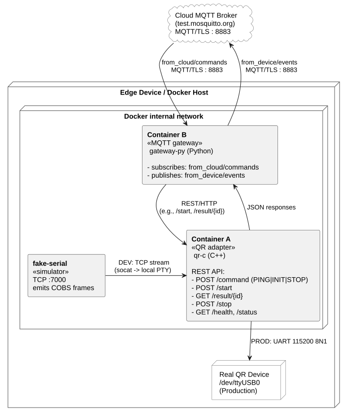
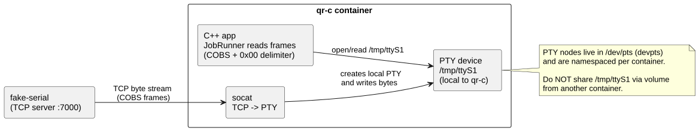
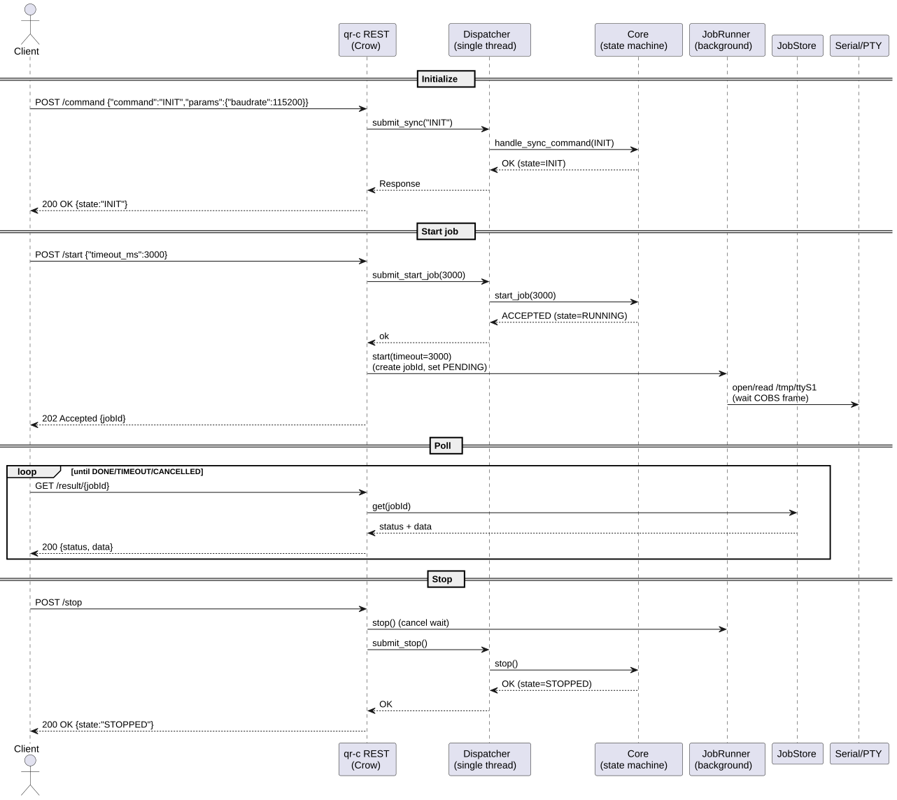
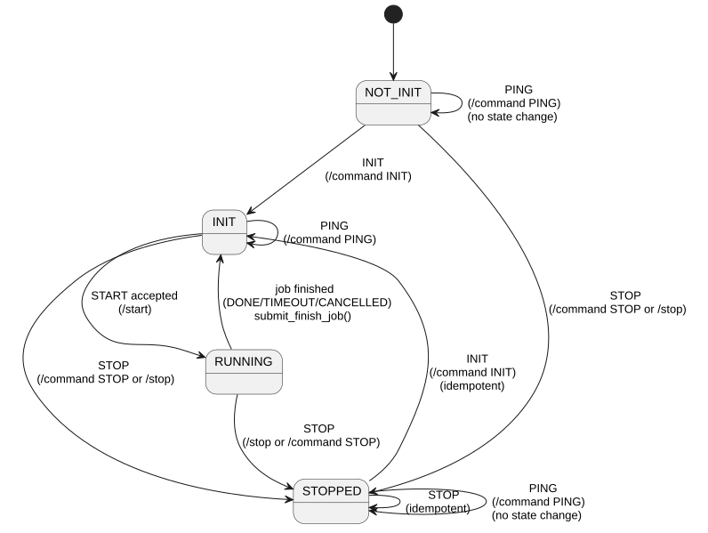
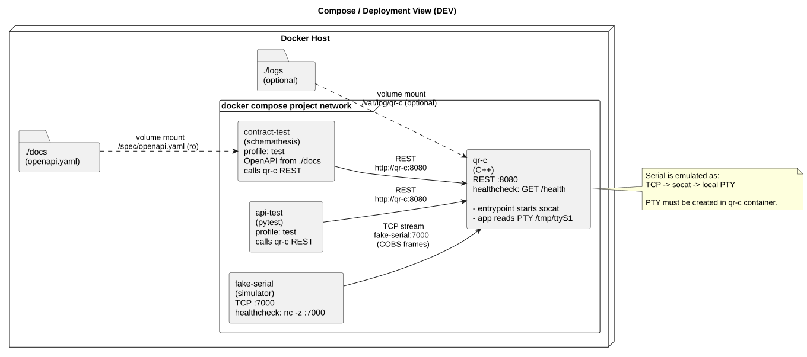
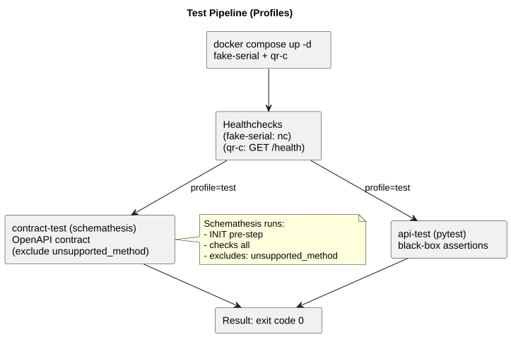

# qr-edge-gateway — Fake QR Reader (Serial Emulation + REST API)

This repository provides a **containerized fake QR reader** used to validate end-to-end flows where a device reads QR codes from a serial-like interface and exposes results via a REST API.

It is built to be:

- **Container-friendly** (logs to stdout, TCP transport between containers, no shared PTYs)
- **Deterministic** (single-threaded Core execution via a Dispatcher)
- **Testable** (pytest black-box tests + OpenAPI contract tests via Schemathesis)

Optionally, it can be driven via an **MQTT gateway** (Container B) that bridges **cloud commands → REST** and publishes **device events → cloud**.

## Contents

- [Quick Start](#quick-start)
- [MQTT Gateway](#mqtt-gateway)
- [What runs where](#what-runs-where)
- [API](#api)
- [Testing](#testing)
- [Diagrams](#diagrams)
- [Documentation](#documentation)
- [Troubleshooting](#troubleshooting)

---

## Quick Start

### Start the core services (Serial emulation + REST API)

```bash
docker compose up -d --build fake-serial qr-c
```

Verify readiness:

```bash
curl -s http://127.0.0.1:8080/health
curl -s http://127.0.0.1:8080/status
```

Run a standard flow (INIT → START → RESULT):

```bash
# INIT (Option B: set baudrate via params)
curl -s -X POST http://127.0.0.1:8080/command \
  -H 'Content-Type: application/json' \
  -d '{"command":"INIT","params":{"baudrate":115200}}'

# START (JSON body required; at least {})
curl -s -X POST http://127.0.0.1:8080/start \
  -H 'Content-Type: application/json' \
  -d '{"timeout_ms":3000}'
```

Poll result (replace `<jobId>`):

```bash
curl -s http://127.0.0.1:8080/result/<jobId>
```

Stop (cancel + stop core):

```bash
curl -s -X POST http://127.0.0.1:8080/stop
```

### Start the full end-to-end stack (includes MQTT gateway)

This starts **fake-serial + qr-c + gateway-py**:

```bash
docker compose up -d --build fake-serial qr-c gateway-py
```

Then run the MQTT commands shown in the next section.

---

## MQTT Gateway
`gateway-py` subscribes to a **cloud command** topic and publishes **device events** back to the broker.

### Recommended broker configuration

Use a TLS-capable public broker with a certificate chain anchored in the system trust store.

Example (HiveMQ public broker):

- `MQTT_HOST=broker.hivemq.com`
- `MQTT_PORT=8883`
- `MQTT_CERT=/etc/ssl/certs/ca-certificates.crt`

### Recommended topic namespace

Public brokers are shared. Use namespaced topics to avoid collisions:

- `MQTT_TOPIC_CMD=wkeller/from_cloud/commands`
- `MQTT_TOPIC_EVENT=wkeller/from_device/events`

### Basic MQTT commands (host-side)

Open a subscriber (Terminal A):

```bash
mosquitto_sub -h broker.hivemq.com -p 8883 \
  --cafile /etc/ssl/certs/ca-certificates.crt \
  -t 'wkeller/from_device/events' -q 1 -v
```

Publish a command (Terminal B):

```bash
mosquitto_pub -h broker.hivemq.com -p 8883 \
  --cafile /etc/ssl/certs/ca-certificates.crt \
  -t 'wkeller/from_cloud/commands' -q 1 \
  -m '{"type":"command","id":"demo-1","command":"PING"}'
```

Expected result on the subscriber:

- An event JSON with `type=command_ack` and `message="PONG"`.

### Supported gateway message patterns

The gateway accepts either:

- `{"type":"command","id":"...","command":"PING"}`
- `{"type":"start","id":"...","timeout_ms":1000}`
- `{"type":"stop","id":"..."}`

Or, equivalently, command-style:

- `{"type":"command","command":"START","timeout_ms":1000}`
- `{"type":"command","command":"STOP"}`

### START / STOP demo

START:

```bash
mosquitto_pub -h broker.hivemq.com -p 8883 \
  --cafile /etc/ssl/certs/ca-certificates.crt \
  -t 'wkeller/from_cloud/commands' -q 1 \
  -m '{"type":"command","id":"demo-2","command":"START","timeout_ms":1000}'
```

Expected events:

- `job_accepted` (HTTP 202 from `/start`) with `jobId`
- `job_result` when the job ends (`DONE|TIMEOUT|CANCELLED`)

STOP:

```bash
mosquitto_pub -h broker.hivemq.com -p 8883 \
  --cafile /etc/ssl/certs/ca-certificates.crt \
  -t 'wkeller/from_cloud/commands' -q 1 \
  -m '{"type":"command","id":"demo-3","command":"STOP"}'
```

---

## What runs where

- **fake-serial**: emits a QR payload stream over TCP (`:7000`)
- **qr-c**:
  - creates a **local PTY** (e.g., `/tmp/ttyS1`) inside this container
  - bridges TCP → PTY using `socat`
  - runs the C++ service:
    - REST API (Crow)
    - Core (state machine)
    - Dispatcher (single worker thread)
    - JobRunner + JobStore (async job + polling)
- **gateway-py** (Container B):
  - connects to an MQTT broker over TLS
  - subscribes to `MQTT_TOPIC_CMD` (cloud commands)
  - calls the qr-c REST API (`QR_API_BASE_URL`) to execute commands
  - publishes acknowledgements/results to `MQTT_TOPIC_EVENT`

Key constraint: **do not share PTYs across containers**. PTYs live in `/dev/pts` and are namespaced per container; a `/tmp/ttyS1` link created in one container is not usable in another.

---

## API

OpenAPI specification:

- `docs/openapi.yaml`

Endpoints:

- `GET /health` — liveness
- `GET /status` — Core state (`NOT_INIT|INIT|RUNNING|STOPPED`)
- `POST /command` — synchronous commands (`PING`, `INIT`, `STOP`)
- `POST /start` — async job start (**JSON body required**)
- `GET /result/{id}` — poll job result (`PENDING|DONE|TIMEOUT|CANCELLED`)
- `POST /stop` — cancel active wait + transition to STOPPED

For detailed request/response semantics and constraints, see:
- `docs/OPERATIONS.md` (curl flows)
- `docs/PROTOCOL.md` (serial framing + payload expectations)

---

## Testing

### API tests (pytest)

```bash
docker compose --profile test run --rm --build api-test
```

### Contract tests (Schemathesis)

```bash
docker compose --profile test run --rm --build contract-test
```

Contract testing notes (why `unsupported_method` is excluded, how to keep OpenAPI aligned):
- `docs/CONTRACT_TESTING.md`

---

## Diagrams

This repository keeps PlantUML sources under `diagrams/` and **rendered SVGs** under `diagrams/out/` so diagrams are visible in GitHub.

### Render diagrams

Using Docker:

```bash
mkdir -p diagrams/out
docker run --rm -v "$PWD/diagrams:/work" plantuml/plantuml:latest \
  -tsvg -o out /work/*.plantuml
```

Or use:

```bash
./render_diagrams.sh
```

Commit the generated `diagrams/out/*.svg` so they display in GitHub.

### Diagram: architecture overview

**What it explains:** end-to-end context (cloud ↔ gateway ↔ QR adapter ↔ serial), and how DEV emulation differs from PROD serial.



If you want the original version, also render and embed:
- `diagrams/architecture.plantuml`

### Diagram: serial emulation dataflow (DEV)

**What it explains:** why the PTY must be created in the *consumer* container (`qr-c`), and how the TCP stream becomes a local serial-like device.



### Diagram: REST job sequence

**What it explains:** request/response ordering and component responsibilities (REST → Dispatcher/Core, async job in JobRunner, polling via JobStore).



### Diagram: Core state machine

**What it explains:** allowed transitions between `NOT_INIT`, `INIT`, `RUNNING`, `STOPPED` and how `/start`, job completion, and `/stop` interact.



### Diagram: Compose deployment view

**What it explains:** ports, volumes, healthchecks, and how test profiles attach to the main services.



### Diagram: Testing pipeline

**What it explains:** how CI-like runs work (healthchecks → api-test + contract-test) and what the contract-test actually does.



---

## Documentation

Minimal documentation set under `docs/`:

- `docs/ARCHITECTURE.md` — rationale (PTY namespaces, dispatcher model)
- `docs/PROTOCOL.md` — framing (COBS + 0x00), payload expectations, limits
- `docs/OPERATIONS.md` — common curl flows, env vars, logs
- `docs/CONTRACT_TESTING.md` — Schemathesis notes and OpenAPI maintenance

---

## Troubleshooting

### MQTT: no events appear

- Check that `gateway-py` is connected and subscribed:

```bash
docker compose logs -f gateway-py
```

- Confirm topics match on both sides (publisher/subscriber and container env vars).
- Prefer namespaced topics on public brokers (e.g., `wkeller/...`).

### `/start` returns `ERR:NOT_INIT`

Run INIT first:

```bash
curl -s -X POST http://127.0.0.1:8080/command \
  -H 'Content-Type: application/json' \
  -d '{"command":"INIT"}'
```

### Job times out (TIMEOUT)

- Check logs:

```bash
docker compose logs -f fake-serial
docker compose logs -f qr-c
```

- Increase `timeout_ms` in `/start`
- Ensure the PTY exists inside `qr-c`:

```bash
docker compose exec qr-c sh -lc 'ls -l /tmp/ttyS1 || true'
```

### Contract test failures

- Ensure the mounted OpenAPI is up to date (`docs/openapi.yaml`)
- See: `docs/CONTRACT_TESTING.md`

## License

Licensed under Creative Commons Attribution–NonCommercial 4.0 International (CC BY-NC 4.0).

Non-commercial use is permitted with attribution. Commercial/professional use is not permitted without prior written permission.

See `LICENSE`.
